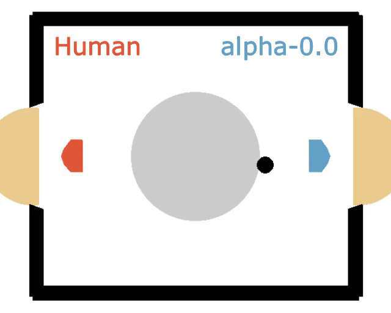
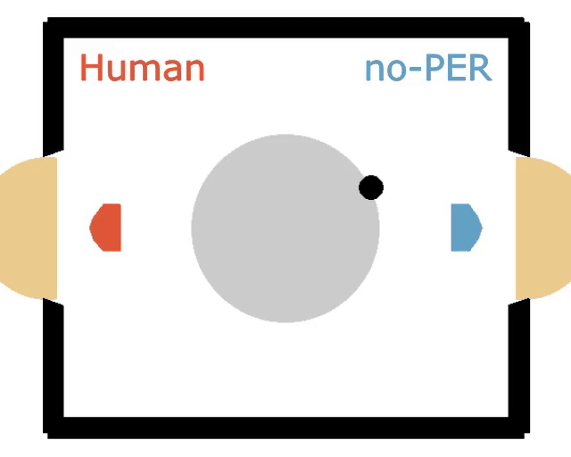

# Mastering Laser Hockey with Soft Actor-Critic Agents
This is the code of Finn Springorum for the 2024/25 Reinforcement Learning project at the University of Tübingen, building on the existing GitHub repositories for the [Soft Actor-Critic](https://github.com/pranz24/pytorch-soft-actor-critic) and [Prioritized Experience Replay](https://github.com/Howuhh/prioritized_experience_replay). No requirements are needed in addition to the RL homework environment and the [Laser Hockey Environment](https://github.com/anticdimi/laser-hockey-env) (see `container.def`).
 - `main.py` starts the SAC training on the Laser Hockey environment as described in the [project report](report/report.pdf). Make sure to check out the command line options with `-h`. For standard [Gymnasium](https://github.com/Farama-Foundation/Gymnasium) environments, run `train_simple_envs.py` from inside the `simple_envs/` directory.
 - `Hockey-Env.ipynb` was used to render games and play against the trained agents. You can do this as well (check last section of notebook) using the provided agent parameter files.
 - `eval-competition.py` was used to run the large-scale evaluation of the 27 trained agents based on their performance against the weak basic opponent, the strong basic opponent, and each other. It outputs a text file `eval_competition_results.txt` that stores the results with arrays of length 4 corresponding to [points, wins, draws, losses]. The results of my large-scale evaluation are in the `stats/` directory.
 - `checkpoints/` contains the training checkpoints. The parameters of the three best-performing SAC agents are included in this repository.

 # Gameplay Videos
🏆 Interestingly, the best-performing agent was the one without entropy regularization:

 

🥈 The second best agent was the one with automatic entropy tuning and uniform experience sampling:

 